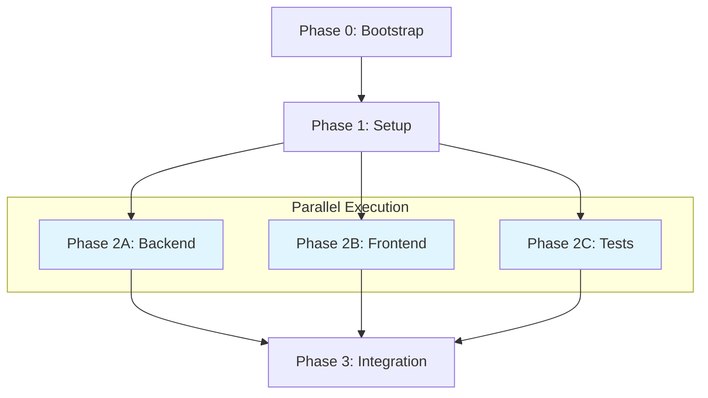

# Phase Execution Reference

> Phase ordering, parallel detection, dependency resolution, and execution batching.

## Phase Identification

### Parsing Phase Overview Table

Plans contain a phase overview table:

```markdown
| Phase | Name | Depends On | Parallel With | Estimate | Status |
|-------|------|------------|---------------|----------|--------|
| 0 | Bootstrap | - | - | 5 | ⬜ |
| 1 | Setup | 0 | - | 3 | ⬜ |
| 2A | Backend | 1 | 2B, 2C | 8 | ⬜ |
| 2B | Frontend | 1 | 2A, 2C | 5 | ⬜ |
| 2C | Tests | 1 | 2A, 2B | 3 | ⬜ |
| 3 | Integration | 2A, 2B, 2C | - | 5 | ⬜ |
```

### Phase ID Normalization

| Raw ID | Normalized |
|--------|------------|
| `Phase 0` | `0` |
| `Phase 1` | `1` |
| `Phase 2A` | `2a` |
| `Phase 2-A` | `2a` |
| `2A` | `2a` |
| `Phase 2a` | `2a` |

**Rules:**
1. Remove "Phase" prefix
2. Lowercase all letters
3. Remove spaces and hyphens
4. Keep alphanumeric only

### Detecting Parallel Groups

Phases are parallel if they share "Parallel With" entries:

```
Phase 2A: Parallel With [2B, 2C]
Phase 2B: Parallel With [2A, 2C]
Phase 2C: Parallel With [2A, 2B]

-> Parallel Group: [2A, 2B, 2C]
```

**Algorithm:**
```python
def find_parallel_groups(phases):
    groups = []
    seen = set()

    for phase in phases:
        if phase.id in seen:
            continue

        if phase.parallel_with:
            group = {phase.id} | set(phase.parallel_with)
            groups.append(sorted(group))
            seen.update(group)
        else:
            groups.append([phase.id])
            seen.add(phase.id)

    return groups
```

---

## Dependency Resolution

### Building Dependency Graph

```python
def build_dependency_graph(phases):
    graph = {}
    for phase in phases:
        graph[phase.id] = {
            "depends_on": phase.depends_on or [],
            "parallel_with": phase.parallel_with or [],
            "blocks": []  # Computed below
        }

    # Compute reverse dependencies (blocks)
    for phase_id, deps in graph.items():
        for dep in deps["depends_on"]:
            graph[dep]["blocks"].append(phase_id)

    return graph
```

### Example Graph

```
Phase 0: depends_on=[], blocks=[1]
Phase 1: depends_on=[0], blocks=[2a, 2b, 2c]
Phase 2A: depends_on=[1], parallel_with=[2b, 2c], blocks=[3]
Phase 2B: depends_on=[1], parallel_with=[2a, 2c], blocks=[3]
Phase 2C: depends_on=[1], parallel_with=[2a, 2b], blocks=[3]
Phase 3: depends_on=[2a, 2b, 2c], blocks=[]
```

### Topological Sort

Sort phases respecting dependencies:

```python
def topological_sort(graph):
    result = []
    in_degree = {node: len(deps["depends_on"]) for node, deps in graph.items()}
    queue = [node for node, degree in in_degree.items() if degree == 0]

    while queue:
        # Sort queue to process parallel groups together
        queue.sort()
        node = queue.pop(0)
        result.append(node)

        for blocked in graph[node]["blocks"]:
            in_degree[blocked] -= 1
            if in_degree[blocked] == 0:
                queue.append(blocked)

    return result
```

### Detecting Circular Dependencies

```python
def has_cycle(graph):
    visited = set()
    rec_stack = set()

    def dfs(node):
        visited.add(node)
        rec_stack.add(node)

        for dep in graph[node]["depends_on"]:
            if dep not in visited:
                if dfs(dep):
                    return True
            elif dep in rec_stack:
                return True

        rec_stack.remove(node)
        return False

    for node in graph:
        if node not in visited:
            if dfs(node):
                return True

    return False
```

**If cycle detected:**
```
DEPENDENCY CYCLE DETECTED
=========================

Phases involved: 2A -> 3 -> 2A

This plan has circular dependencies and cannot be executed.
Please fix the plan's "Depends On" column.

[EXIT - Invalid plan]
```

---

## Execution Batching

### Creating Execution Batches

Group phases into sequential batches:

```python
def create_execution_batches(phases, parallel_groups):
    batches = []
    executed = set()
    remaining = set(p.id for p in phases)

    while remaining:
        # Find phases whose dependencies are all met
        ready = []
        for phase_id in remaining:
            deps = graph[phase_id]["depends_on"]
            if all(d in executed for d in deps):
                ready.append(phase_id)

        if not ready:
            raise Exception("Deadlock - unmet dependencies")

        # Check if ready phases form a parallel group
        for group in parallel_groups:
            if set(group).issubset(set(ready)):
                batches.append({"type": "parallel", "phases": group})
                executed.update(group)
                remaining -= set(group)
                break
        else:
            # Execute first ready phase sequentially
            phase = ready[0]
            batches.append({"type": "sequential", "phases": [phase]})
            executed.add(phase)
            remaining.remove(phase)

    return batches
```

### Example Batch Output

```
EXECUTION BATCHES
=================

Batch 1: sequential
  - Phase 0 (Bootstrap)

Batch 2: sequential
  - Phase 1 (Setup)

Batch 3: parallel
  - Phase 2A (Backend)
  - Phase 2B (Frontend)
  - Phase 2C (Tests)

Batch 4: sequential
  - Phase 3 (Integration)
```

---

## Execution Order Visualization

### ASCII Diagram

```
EXECUTION ORDER
===============

[Phase 0: Bootstrap]
        |
        v
[Phase 1: Setup]
        |
        +--------+--------+
        |        |        |
        v        v        v
    [2A]     [2B]     [2C]     <- PARALLEL
        |        |        |
        +--------+--------+
                |
                v
    [Phase 3: Integration]
```

### Mermaid Diagram (for plan documentation)



---

## Phase Status Transitions

```
           +------------------+
           |     pending      |
           +--------+---------+
                    |
           (dependencies met)
                    |
                    v
           +------------------+
           |     running      |<----+
           +--------+---------+     |
                    |               |
         +----------+----------+    |
         |                     |    |
    (success)             (failure) |
         |                     |    |
         v                     v    |
+------------------+  +------------------+
|    complete      |  |     retry        |--+ (attempt < max)
+------------------+  +--------+---------+
                               |
                          (attempt >= max)
                               |
                               v
                      +------------------+
                      |     failed       |
                      +------------------+
```

### Status Transition Rules

| From | To | Condition |
|------|-----|-----------|
| pending | running | All dependencies complete |
| running | complete | Sub-agent success + verification passed |
| running | failed | Sub-agent failed + max retries reached |
| failed | running | Resume with --resume (resets attempt count) |
| complete | - | Terminal state |

---

## Handling Blocked Phases

When a phase fails, update blocked phases:

```python
def update_blocked_phases(failed_phase, graph, states):
    blocked = set()

    def find_blocked(phase_id):
        for downstream in graph[phase_id]["blocks"]:
            if downstream not in blocked:
                blocked.add(downstream)
                states[downstream]["status"] = "blocked"
                states[downstream]["error"] = {
                    "type": "blocked",
                    "message": f"Blocked by failed phase {failed_phase}"
                }
                find_blocked(downstream)

    find_blocked(failed_phase)
    return blocked
```

### Blocked Phase State

```json
{
  "phase_id": "3",
  "phase_name": "Integration",
  "status": "blocked",
  "error": {
    "type": "blocked",
    "message": "Blocked by failed phase 2a",
    "blocking_phase": "2a"
  }
}
```

---

## Resume Logic

### Determining Resume Point

```python
def find_resume_point(states, batches):
    for batch in batches:
        for phase_id in batch["phases"]:
            state = states.get(phase_id)
            if not state:
                return batch  # New phase
            if state["status"] in ("pending", "failed", "running", "blocked"):
                return batch

    return None  # All complete
```

### Resume Scenarios

| State | Resume Action |
|-------|---------------|
| Phase 2A: failed | Retry Phase 2A (reset attempt count) |
| Phase 2A: running | Re-run Phase 2A (may have been interrupted) |
| Phase 2A: complete, 2B: pending | Start Phase 2B |
| Phase 3: blocked by 2A | First resume 2A |
| All complete | Output completion summary |

---

## Parallel Execution

### Launching Parallel Sub-Agents

```
LAUNCHING PARALLEL BATCH
========================

Phases: 2A, 2B, 2C
Method: Concurrent Task tool calls with run_in_background: true

Task 2A: [launched] -> task-id-abc
Task 2B: [launched] -> task-id-def
Task 2C: [launched] -> task-id-ghi

Waiting for all tasks to complete...
```

### Collecting Parallel Results

```python
def execute_parallel_batch(phases):
    # Launch all sub-agents
    task_ids = {}
    for phase in phases:
        task_id = launch_subagent(phase, run_in_background=True)
        task_ids[phase.id] = task_id

    # Wait for all to complete
    results = {}
    for phase_id, task_id in task_ids.items():
        result = wait_for_task(task_id)
        results[phase_id] = result

    return results
```

### Parallel Batch Completion

```
PARALLEL BATCH COMPLETE
=======================

Results:
| Phase | Status | Duration |
|-------|--------|----------|
| 2A | complete | 10m 15s |
| 2B | complete | 8m 30s |
| 2C | complete | 5m 45s |

All phases in batch successful.
Proceeding to next batch...
```

### Partial Parallel Failure

```
PARALLEL BATCH PARTIAL FAILURE
==============================

Results:
| Phase | Status | Duration |
|-------|--------|----------|
| 2A | FAILED | 15m 00s |
| 2B | complete | 8m 30s |
| 2C | complete | 5m 45s |

Phase 2A failed. Initiating retry...

[After retry]

Phase 2A failed after retry.
Successful phases (2B, 2C) preserved.
Phase 3 blocked until 2A succeeds.

AUTOBUILD HALTED
```

---

## Dry Run Mode

With `--dry-run` flag, validate and display without executing:

```
DRY RUN - EXECUTION PREVIEW
============================

Plan: docs/feature-plan.md
Commit Mode: auto

Stack Detection:
- Language: TypeScript
- Framework: Express
- Tests: Jest

Execution Order:

Batch 1 (sequential):
  [0] Bootstrap (5 pts)
      Dependencies: none
      Tasks: 4

Batch 2 (sequential):
  [1] Setup (3 pts)
      Dependencies: [0]
      Tasks: 3

Batch 3 (parallel):
  [2A] Backend (8 pts)
       Dependencies: [1]
       Tasks: 5
  [2B] Frontend (5 pts)
       Dependencies: [1]
       Tasks: 4
  [2C] Tests (3 pts)
       Dependencies: [1]
       Tasks: 3

Batch 4 (sequential):
  [3] Integration (5 pts)
      Dependencies: [2A, 2B, 2C]
      Tasks: 4

Total: 6 phases, 24 points, 23 tasks

Validation: PASSED
Ready to execute with: /autobuild docs/feature-plan.md --commit=auto
```
